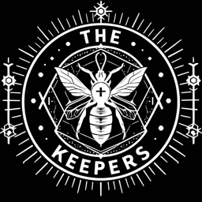

# Keepers Temple

<p align="center">
  
</p>

A local-first chat UI that wires any [Ollama](https://ollama.com) model to a [MemPalace](https://github.com/MemPalace/mempalace) memory layer. Your conversations build a persistent, searchable memory that the model recalls automatically — and tool-capable models can curate the memory themselves as you chat.

Everything stays on your machine. No API keys. No data leaves your laptop.

## Why this exists

Ollama gives you great local models. MemPalace gives you a serious memory backend with wings, rooms, a temporal knowledge graph, and an MCP server. But the official Ollama desktop app has no plugin system and can't talk to MemPalace. Keepers Temple is the missing UI: an Ollama-style chat experience with MemPalace stitched in as a first-class layer.

## Features

**Chat**
- Streaming chat against any Ollama model
- Sidebar with sessions grouped by date (Today / This Week / Older), wing-filtered, with rename/delete
- Incognito chat mode — no recall, no save, no fact extraction
- Drag-drop file attachments (per-message context, like Claude/ChatGPT)
- Thinking-model support (Qwen 3.6, gpt-oss, gemma4) — reasoning shown as a collapsible pill

**Memory (MemPalace integration)**
- **Wings** — top-level domains (project / person / topic). Memory recall is wing-scoped.
- **Rooms** — sub-buckets within wings. Auto-extracted facts file into MemPalace `hall_*` rooms.
- **Layer 0 identity** (`~/.mempalace/identity.txt`) — persistent system prompt loaded into every chat
- **Layer 1 wakeup preview** — see the auto-summarized "essential story" before chatting
- **Layer 2 on-demand recall** — wing/room-scoped retrieval API
- **Layer 3 deep search** — semantic search via ChromaDB with BM25 hybrid re-ranking
- **Knowledge graph** — temporal facts (subject → predicate → object) with validity windows. Add, query, invalidate, timeline.
- **Tunnels** — explicit cross-wing room links
- **Diary** — agent's own journal
- **Permanent wing files** — drop docs into a wing, they get chunked into the recall corpus
- **Conversation import** — bulk import Claude Code / ChatGPT / Slack exports via `mempalace mine`
- **Drawer browser** — paginated, filterable list of every memory; click to expand, edit, delete
- **AAAK spec viewer** — MemPalace's compressed memory dialect

**Tool calling** (opt-in)
- Five tools exposed to compatible models: `memory_search`, `kg_query`, `kg_add`, `kg_invalidate`, `diary_write`
- Best with larger tool-capable models: `gpt-oss:20b`, `gemma4:26b`, `ishumilin/deepseek-r1-coder-tools:14b`, `qwen3.6:35b-a3b-q4_K_M`
- Tool calls render as collapsible chips on the assistant message — you see exactly what the model called and what it got back

**UX polish**
- Settings overlay with identity editor, per-wing system prompt, behavior toggles, attachments management
- First-run welcome modal with a name field that builds the default identity
- Mac-native dark theme with custom-styled scrollbars
- Memory hits side panel for debugging recall

## Requirements

- macOS or Linux (primary tested platform: macOS 14+ Apple Silicon)
- Python 3.9+
- [Ollama](https://ollama.com/download) installed and running
- ~150 MB for Python deps + the embedding model that MemPalace pulls on first search

## Setup

```bash
git clone https://github.com/p3t3rango/keepers-temple.git
cd keepers-temple
python3 -m venv .venv
source .venv/bin/activate
pip install -r requirements.txt
```

## Run

```bash
# Make sure Ollama is running (the desktop app or `ollama serve`)
.venv/bin/python app.py
```

Open http://localhost:8765.

On first launch a welcome modal asks for your name and writes a default identity file. After that, just chat.

## Recommended models

For best results across recall + tool calling on a 32-64 GB Mac:

| Use case | Model | Why |
|---|---|---|
| General chat with tools | `gpt-oss:20b` | Solid generalist, tool-capable, fast |
| Coding with tools | `ishumilin/deepseek-r1-coder-tools:14b` | Qwen 2 base + DeepSeek coder fine-tune + tools |
| Big reasoning | `qwen3.6:35b-a3b-q4_K_M` | MoE, ~20 tok/s on M4 Max |
| Vision + tools | `gemma4:26b` | 256k context, multimodal |

Pull any with `ollama pull <name>`.

## Data layout

Everything MemPalace persists lives outside this repo:

```
~/.mempalace/
  identity.txt              Layer 0 — your AI's persistent identity
  config.json               Wing/hall config + entity language
  knowledge_graph.sqlite3   Temporal KG triples
  tunnels.json              Cross-wing room links
  palace/                   ChromaDB drawer + closet collections
```

Sessions and per-wing system prompts live in browser localStorage (per-browser, not synced).

## Environment variables

- `OLLAMA_HOST` — defaults to `http://localhost:11434`
- `MEMPALACE_PALACE_PATH` — defaults to `~/.mempalace/palace`

## Quick capture (global hotkey)

Two ways to send a thought into a new chat without picking up the mouse:

**Built-in shortcuts** (when the tab is focused):
- `⌘ K` — focus the composer
- `⌘ ⇧ N` — new chat
- `⌘ ⇧ I` — new incognito chat
- `⌘ B` — toggle sidebar
- `Esc` — close any open modal

**True global hotkey** — pair the URL-param API with a launcher:

`http://localhost:8765/?q=text&wing=journal&persona=journal-companion&submit=1`

Supported params: `q` (prefill text), `wing`, `persona`, `model`, `incognito=1`, `submit=1` (auto-send instead of just prefilling).

Raycast / Alfred / Shortcuts / Hammerspoon — bind a hotkey that opens
that URL with your selected text. Example Hammerspoon:

```lua
hs.hotkey.bind({"cmd", "shift"}, "M", function()
  local text = hs.pasteboard.getContents() or ""
  local url = "http://localhost:8765/?q=" .. hs.http.encodeForQuery(text) .. "&submit=1"
  hs.urlevent.openURL(url)
end)
```

## Use your palace from Claude Desktop / Cursor / Codex (MCP)

`mcp_stdio.py` exposes your palace as a Model Context Protocol server.
Any MCP-aware client can read your knowledge graph, search memory,
write to the diary, etc., through the standard protocol.

**Wire it to Claude Desktop** — edit
`~/Library/Application Support/Claude/claude_desktop_config.json`:

```json
{
  "mcpServers": {
    "mempalace": {
      "command": "/absolute/path/to/keepers-temple/.venv/bin/python",
      "args": [
        "/absolute/path/to/keepers-temple/mcp_stdio.py"
      ]
    }
  }
}
```

Restart Claude Desktop. You'll see the `mempalace` server listed in its
tools panel. Five tools are exposed (`memory_search`, `kg_query`,
`kg_add`, `kg_invalidate`, `diary_write`) plus three read-only resources
(`palace://stats`, `palace://taxonomy`, `palace://kg/stats`).

Same setup pattern works for Cursor (`~/.cursor/mcp.json`) and any other
MCP-aware client — just point at the same Python interpreter and script.

## API surface

The backend (FastAPI) exposes 36 endpoints under `/api/*`. Highlights:

- `POST /api/chat` — streaming chat with optional tool calling
- `GET/POST/PATCH/DELETE /api/drawers/*` — memory CRUD
- `GET/POST /api/kg/*` — knowledge graph operations
- `GET /api/wings` + per-wing attach/import-convos
- `GET /api/wakeup` — Layer 0 + Layer 1 preview
- `GET /api/aaak-spec` — MemPalace's dialect spec
- `POST /api/reconnect` — refresh ChromaDB cache after CLI edits

Hit `/docs` (FastAPI auto-generated Swagger UI) for the full schema.

## Architecture

```
┌──────────────┐    ┌──────────────────┐    ┌─────────────────┐
│  Browser UI  │ ←→ │ FastAPI (app.py) │ ←→ │ MemPalace Python│
│              │    │                  │    │ + ChromaDB      │
│ • Sessions   │    │ • Chat streaming │    │ + KG SQLite     │
│ • Memory     │    │ • Tool loop      │    │ + Tunnels       │
│   modal      │    │ • Identity I/O   │    └─────────────────┘
│ • Settings   │    │ • Wing CRUD      │
└──────────────┘    │                  │    ┌─────────────────┐
                    │                  │ ←→ │ Ollama HTTP API │
                    └──────────────────┘    │ /api/chat /tags │
                                            └─────────────────┘
```

No build step. Vanilla HTML / CSS / JS for the frontend, single-file FastAPI backend.

## License

MIT — see [LICENSE](LICENSE).

## Acknowledgements

- [MemPalace](https://github.com/MemPalace/mempalace) by the MemPalace team — the memory backend doing all the hard work
- [Ollama](https://ollama.com) — local model runtime
- [ChromaDB](https://www.trychroma.com/) — vector store
